# Welcome to Backstage

---
####    Backstage 开发者平台
---
# Backstage开发新项目流程

#### 环境准备：
1. backstage开发者平台
2. https的gitlab
3. Jenkins
4. sonarqube
5. k8s集群

## 开发新项目

理论支撑：
基于已有的门户网站（例：rdev_portal）为模板新建一个web应用（SSR-example-project）构建并部署的过程。

#### 一、新建web（SSR-example-project）网站
进入创建模板菜单：点击“create a New Component”

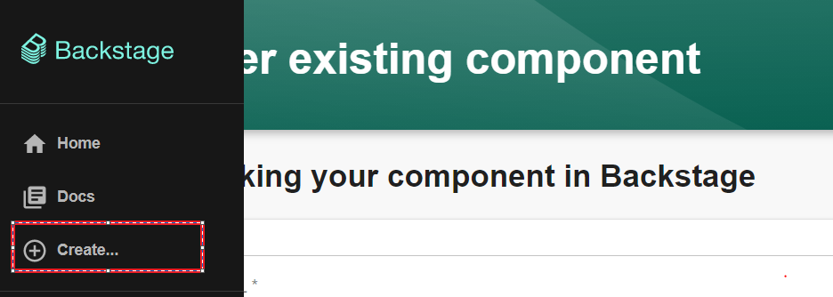

选择已存在模板      
######方法1：选择配置中已存在的模板     
<!-- 此处的REGISTER EXISTING COMPONENT按钮只能注册实体项目,不能注册模板.模板需要在yaml文件中静态引入，且只能引入github上的模板，无法引入gitlab模板，关于如何引入gitlab模板，待研究 -->
	    
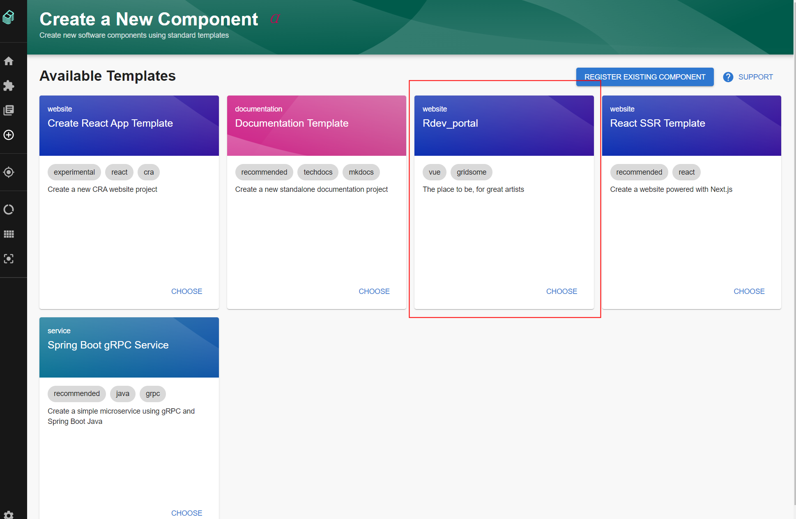

点击“CHOOSE” 进入创建新项目流程：
###### (1).Fill in template parameters
	1. 填写名称name：SSR-example-project
	2. 点击“NEXT STEP”

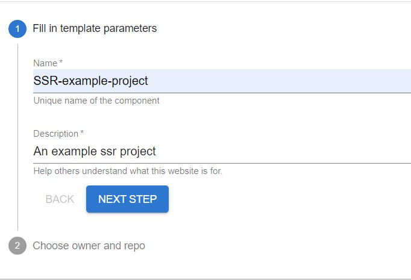

###### (2).Choose owner and repo
	1. 填写“Owner” （使用者身份）
	2. 填写“Store path”  （gitlab上新项目路径：ssr-test-project为新生成项目，此路径不能是已存在的）
	
<!-- ，斜杠'/'前的用户名填写规则待研究 -->
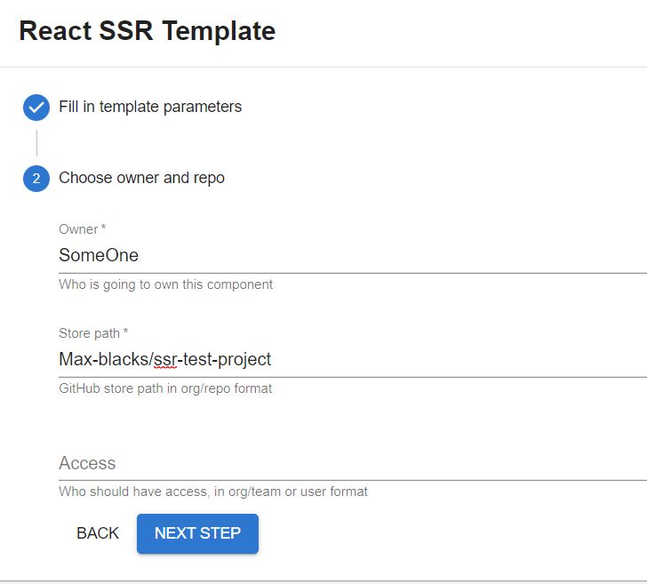

###### (3).Review and create
	1. 点击“CREATE”

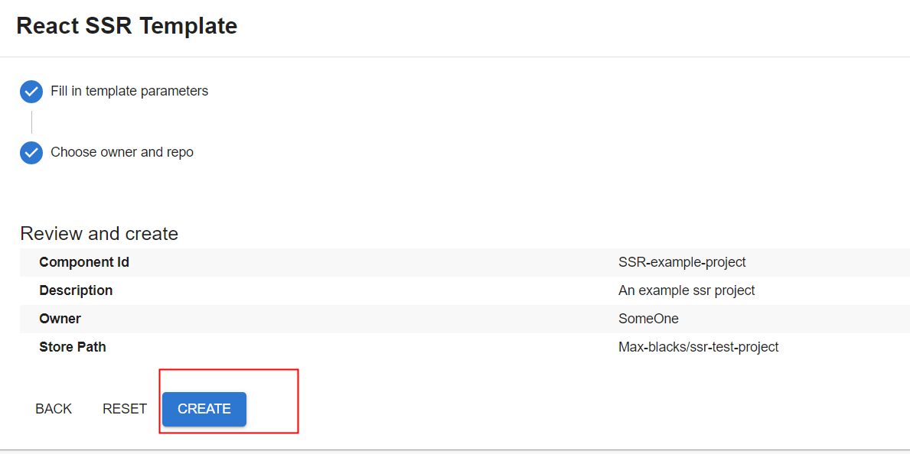

###### (4).Create component
	1. 创建需要时间，请等待......
	
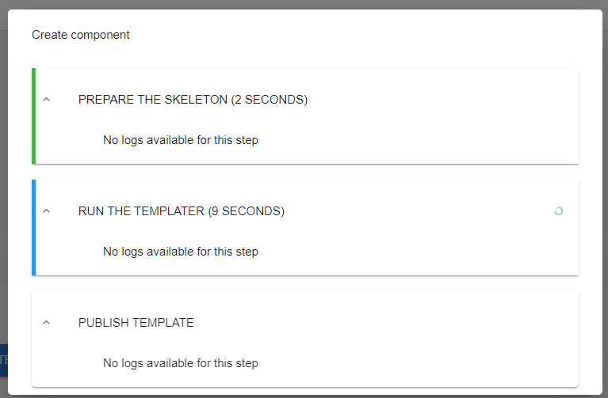

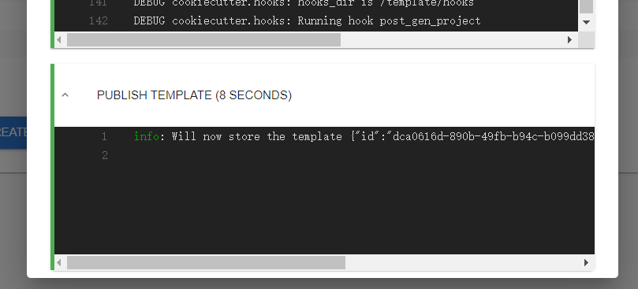

###### (5).Create component success
		在gitlab上生成了新的（SSR-example-project）工程
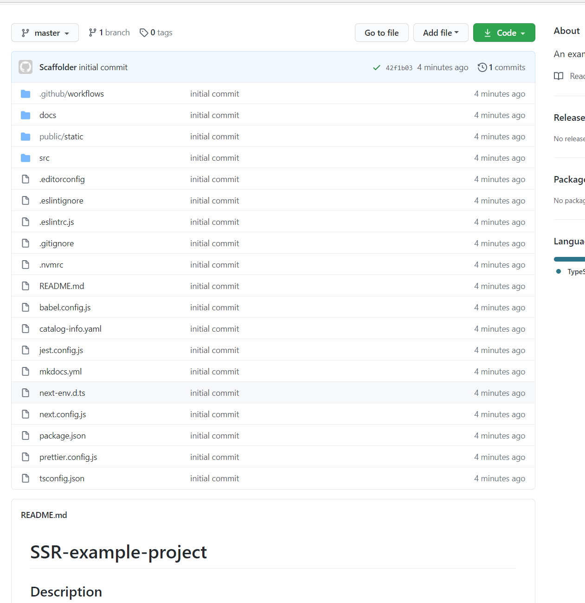
	

######方法2：注册在gitlab已存在的模板
		例如：https的gitlab上已有门户网站代码（rdev_portal）
代码目录：

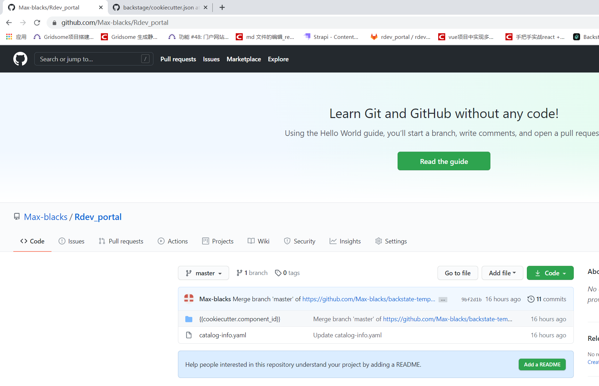

yml示例：
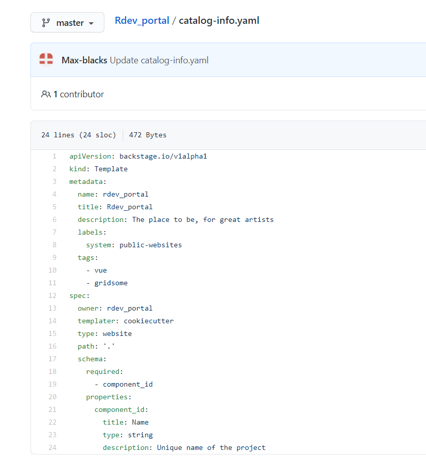

###### (1). 选择register exsiting component
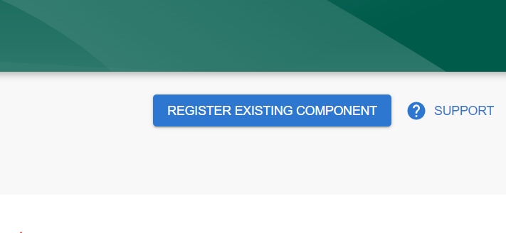

###### (2). 填写url  
（rdev_portal的yml路径：<u>https://github.com/Max-blacks/Rdev_portal/blob/master/catalog-info.yaml</u>）

		接下来步骤同方法1，在gitlab上生成了新的（SSR-example-project）工程

#### 二、生成新项目的doc
在backstage的doc菜单，点击“doc”，
能看到刚刚新建的（SSR-example-project）的doc文档，
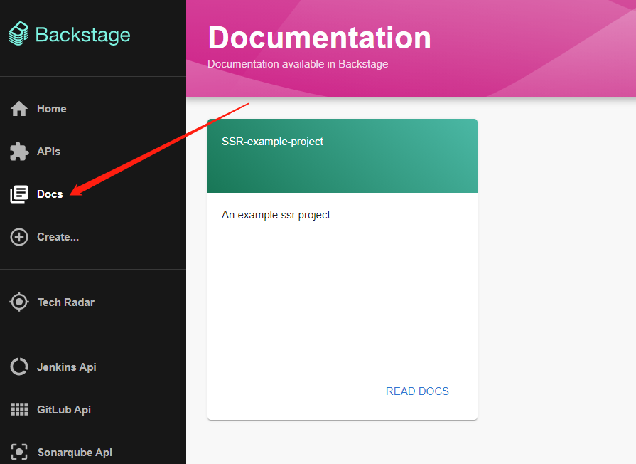

点击进入详情：
详情包含：此模板被使用的信息（被使用计数显示，谁使用者信息）
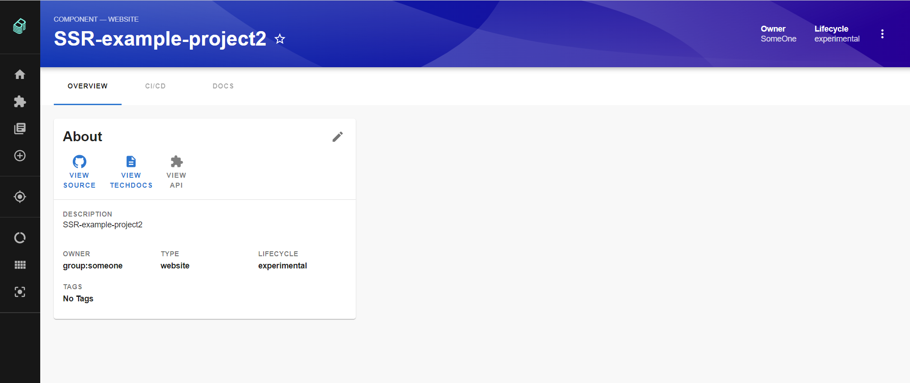

#### 三、Jenkins任务
1. 在backstage的Jenkins菜单，点击“创建”任务，为（SSR-example-project）新建task，

1. 点击此task能看到详情，创建错误可以删除

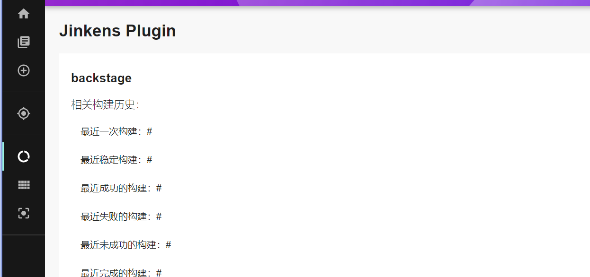

3. 配置SSR-example-project任务的configuration，关联gitlab和sonarqube。
<!-- 在backstage的Jenkins菜单，可以看到历史项目构建列表，点击某个项目可以看到该项目的构建详情

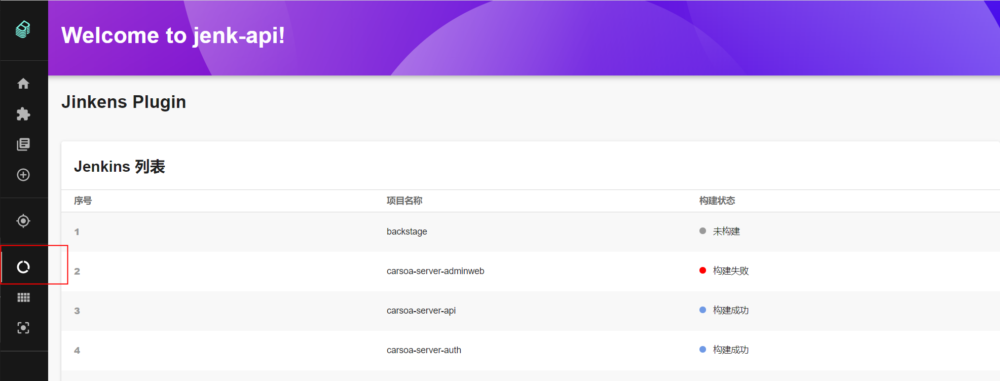

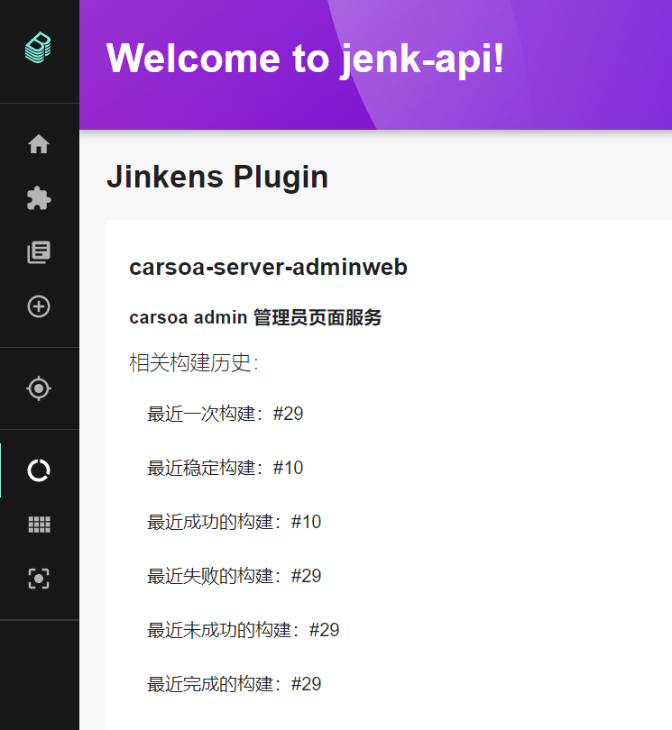 -->

#### 四、在gitlab查看（SSR-example-project）
1. Backstage的gitlab菜单，能看到（SSR-example-project）信息（包括clone地址）

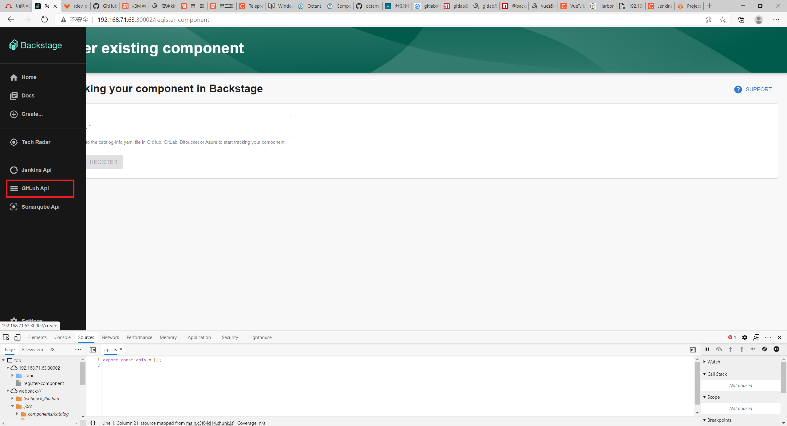

2. 开发者对（SSR-example-project）项目进行修改，提交commit，Backstage的gitlab里面（SSR-example-project）的详情：可以看到commit的开发者，commit的次数，reviewer等

#### 五、Jenkins构建
1. 在开发者提交commit后，在backstage的Jenkins菜单里，（SSR-example-project）任务可以看到构建状态，
2. 构建成功->部署，构建失败->点击查看日志

#### 六、部署
构建成功后在k8s上可以看到（SSR-example-project）部署的信息

